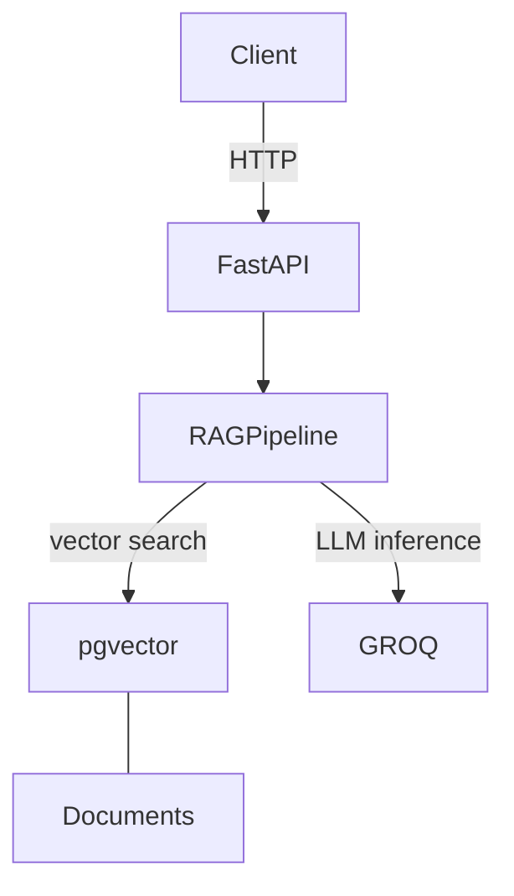

# DevOps Decision RAG System

A production-grade Retrieval-Augmented Generation (RAG) system for DevOps best practices and architectural decisions. Built with Groq (OpenAI-compatible LLM inference), local `fastembed` embeddings, and Neon Postgres with pgvector, deployed on Fly.io.

**Status:** Ready for deployment | **Last Updated:** April 2026

## Table of Contents

- [Overview](#overview)
- [Architecture](#architecture)
- [Tech Stack](#tech-stack)
- [Quick Start](#quick-start)
- [Deployment](#deployment)
- [API Usage](#api-usage)
- [Monitoring & Observability](#monitoring--observability)
- [Cost Optimization](#cost-optimization)
- [Contributing](#contributing)

---

## Overview

This system demonstrates operational expertise in:

- **LLM Integration:** Groq (OpenAI-compatible API) for response generation
- **Local Embeddings:** `fastembed` with BAAI/bge-small-en-v1.5 — no LLM calls during retrieval
- **Vector Search:** PostgreSQL with pgvector for semantic similarity matching
- **Platform-as-a-Service:** Fly.io Machines with auto-stop/auto-start for cost control
- **Managed Database:** Neon serverless Postgres with branching and autoscaling
- **Cost Awareness:** Per-request cost tracking (input/output tokens, configurable per provider)
- **Observability:** In-DB query/ingest metrics tables + structured logs

### Key Features

- **Semantic Search:** Query a knowledge base of DevOps best practices using natural language
- **Cost Tracking:** Monitor API costs and query efficiency in real-time
- **High Availability:** Neon multi-region failover with auto-starting Fly.io Machines
- **Observability:** Comprehensive metrics for latency, token usage, and costs
- **Production Ready:** Health checks, error handling, and proper logging

---

## Architecture

### System Design

```
┌──────────────────────────────────────────────────────────┐
│ Clients (curl, SDKs, monitoring tools)                   │
└────────────────────┬─────────────────────────────────────┘
                     │ HTTPS
┌────────────────────▼─────────────────────────────────────┐
│ Fly.io Proxy (TLS termination, global anycast)           │
└────────────────────┬─────────────────────────────────────┘
                     │
┌────────────────────▼─────────────────────────────────────┐
│ Fly.io Machines — FastAPI app (IAD region)               │
│ ┌──────────────────────────────────────────────────────┐ │
│ │ RAG Pipeline                                         │ │
│ │ - Embeddings: fastembed (local BGE, CPU)             │ │
│ │ - Retrieval: pgvector cosine similarity              │ │
│ │ - Inference: Groq (OpenAI-compatible HTTP)           │ │
│ │ - Metrics: in-DB query_metrics / ingest_metrics      │ │
│ └──────────────────────────────────────────────────────┘ │
│ auto_stop_machines=stop, min_machines_running=0          │
└────────────────────┬─────────────────────────────────────┘
                     │
                     │ TLS over public network
        ┌────────────┴──────────────┐
        │                           │
┌───────▼──────────────┐   ┌────────▼───────────────────┐
│ Neon Postgres        │   │ Groq API                   │
│ - documents table    │   │ (api.groq.com/openai/v1)   │
│ - query_metrics      │   │ - llama-3.3-70b-versatile  │
│ - ingest_metrics     │   │ - Free tier, OpenAI SDK    │
│ - pgvector index     │   └────────────────────────────┘
│ Serverless branching │
└──────────────────────┘
```

### Diagram


### Key Decision Records

**ADR-1: Vector Database Choice**
- Decision: PostgreSQL + pgvector (not managed vector DB)
- Rationale: Cost control, ACID guarantees, easier backup/restore, pgvector is production-grade
- Tradeoff: Slightly lower throughput vs. Pinecone, but full control over scaling

**ADR-2: LLM & Embedding Strategy**
- Decision: Local `fastembed` (BGE-small-en-v1.5) for embeddings, Groq for inference via OpenAI-compatible API
- Rationale: Local embeddings eliminate per-retrieval API cost and network latency; Groq free tier + OpenAI SDK keeps the inference layer pluggable (any OpenAI-compatible provider works)
- Tradeoff: CPU-bound embedding at ingest time; accept Groq's rate limits on free tier

**ADR-3: Deployment Platform**
- Decision: Fly.io Machines + Neon Postgres (replaces earlier AWS ECS + RDS stack)
- Rationale: Sub-$10/month running cost, auto-stop when idle, no VPC/IAM/Terraform overhead; Neon branching enables cheap ephemeral preview databases
- Tradeoff: Smaller operational surface area than AWS but fewer enterprise knobs; acceptable for this workload

**ADR-4: Cost Tracking Approach**
- Decision: Per-request granular tracking in `query_metrics` / `ingest_metrics` Postgres tables; cost-per-M-token rates configurable via env vars (default 0 for Groq free tier)
- Rationale: Understand cost-per-feature, identify expensive queries, enable easy provider swaps without rewiring cost code
- Tradeoff: Slightly higher storage overhead, but critical for production cost control

---

## Tech Stack

### Backend
- **FastAPI** (0.104+) - High-performance async web framework
- **Python 3.11** - Latest stable version
- **PostgreSQL 15** - ACID-compliant relational database
- **pgvector 0.5+** - Vector similarity search

### AI/ML
- **fastembed** (0.4+) — Local ONNX embedding model, no API calls
  - Model: `BAAI/bge-small-en-v1.5` (384-dim)
- **Groq** — OpenAI-compatible LLM inference (default: `llama-3.3-70b-versatile`)
- **openai** Python SDK — provider-agnostic interface for Groq, OpenAI, or any OpenAI-compatible endpoint

### Infrastructure
- **Fly.io Machines** — Firecracker microVMs with auto-stop/auto-start
- **Neon** — Serverless Postgres with branching
- **Fly.io Secrets** — Encrypted at rest, injected as env vars at runtime
- **macOS Keychain** (local dev) — Secrets stored outside `.env`

### Monitoring
- **In-DB metrics** — `query_metrics` and `ingest_metrics` Postgres tables
- **Structured logs** — `fly logs` for streaming, per-machine tailing
- **Optional CloudWatch bridge** — `metrics.py` supports AWS CloudWatch if `AWS_REGION` + creds are set

---

## Quick Start

### Prerequisites

- Python 3.11+
- PostgreSQL 14+ with `pgvector` (local Docker, or a Neon project)
- Groq API key (free tier at https://console.groq.com)
- Fly.io CLI (`flyctl`) — only required for deployment

### Local Development

1. **Clone and setup:**
   ```bash
   git clone <repo>
   cd devops-rag-system
   python -m venv venv
   source venv/bin/activate  # or: venv\Scripts\activate on Windows
   ```

2. **Install dependencies:**
   ```bash
   pip install -r backend/requirements.txt
   ```

3. **Configure environment:**
   ```bash
   cp .env.example .env
   # Edit .env with your settings
   export $(cat .env | xargs)
   ```

4. **Start PostgreSQL (Docker):**
   ```bash
   docker-compose up -d postgres
   # Wait for database to be ready
   sleep 5
   ```

5. **Run application:**
   ```bash
   cd backend
   uvicorn main:app --reload --port 8000
   ```

6. **Test the API:**
   ```bash
   # Health check
   curl http://localhost:8000/health
   
   # Ingest a document
   curl -X POST http://localhost:8000/ingest \
     -H "Content-Type: application/json" \
     -d '{
       "title": "Kubernetes Cost Optimization",
       "content": "Best practices for reducing Kubernetes spending...",
       "category": "best_practice",
       "tags": ["kubernetes", "cost", "devops"]
     }'
   
   # Query the knowledge base
   curl -X POST http://localhost:8000/query \
     -H "Content-Type: application/json" \
     -d '{"query": "How can I reduce Kubernetes costs?"}'
   
   # Get metrics
   curl http://localhost:8000/metrics
   ```

---

## Deployment

Fly.io is the production target (see `fly.toml`). The schema is auto-created by FastAPI on first startup, so there's no separate migration step.

### Prerequisites

- `flyctl` installed — `brew install flyctl` (macOS) or see https://fly.io/docs/flyctl/install
- `fly auth login`
- A Neon project (free tier is fine) — grab the pooled connection string from the Neon console
- A Groq API key — https://console.groq.com

### Deploy

1. **Create the Fly app (first time only):**
   ```bash
   fly launch --no-deploy --copy-config
   ```

2. **Set secrets** (encrypted, injected at runtime — never touches the repo or image):
   ```bash
   fly secrets set \
     DATABASE_URL="postgresql://<user>:<pwd>@<neon-host>/neondb?sslmode=require" \
     GROQ_API_KEY="gsk_..."
   ```

3. **Deploy:**
   ```bash
   fly deploy
   ```
   Fly builds `backend/Dockerfile`, rolls out machines one at a time, runs health checks, and promotes on success.

4. **Ingest the knowledge base** (one-time, against the deployed API):
   ```bash
   python scripts/ingest_knowledge_base.py --endpoint https://<your-app>.fly.dev
   ```

### Monitoring Deployment

```bash
fly status -a devops-rag-system            # machine state
fly logs -a devops-rag-system              # stream logs
fly releases -a devops-rag-system          # deploy history
fly secrets list -a devops-rag-system      # confirm secrets present (values hidden)
```

### Rollback

```bash
fly releases -a devops-rag-system          # find the previous release version
fly deploy --image <previous-release-image>
```

### Cleanup

```bash
# Destroy the Fly app (removes machines, secrets, volumes; release history kept)
fly apps destroy devops-rag-system

# Delete the Neon project (removes the database)
# Neon console → Project settings → Delete project
```

---

## API Usage

### Base URL
```
https://<your-app>.fly.dev/
```

### Endpoints

#### 1. Health Check
```bash
GET /health

# Response
{
  "status": "healthy",
  "timestamp": "2024-01-01T12:00:00Z",
  "database": "healthy",
  "llm_api": "healthy"
}
```

#### 2. Query Knowledge Base
```bash
POST /query

# Request
{
  "query": "How should I optimize Kubernetes resource requests?",
  "top_k": 5,
  "include_metadata": true
}

# Response
{
  "query": "How should I optimize Kubernetes resource requests?",
  "answer": "Based on DevOps best practices...",
  "sources": [
    {
      "id": 1,
      "title": "Kubernetes Resource Management",
      "similarity": 0.92,
      "category": "best_practice"
    }
  ],
  "metadata": {
    "query_id": "query_1672531200000",
    "tokens_used": 245,
    "latency_ms": 1250.45,
    "cost_usd": 0.004521,
    "embedding_latency_ms": 150.23,
    "retrieval_latency_ms": 245.67,
    "llm_latency_ms": 854.55,
    "num_sources": 3
  }
}
```

#### 3. Ingest Documents
```bash
POST /ingest

# Request
{
  "title": "Incident Response Playbook",
  "content": "When database becomes unresponsive...",
  "category": "playbook",
  "tags": ["incident", "database", "runbook"]
}

# Response
{
  "status": "success",
  "ingest_id": "ingest_1672531200000",
  "title": "Incident Response Playbook",
  "chunks_created": 5,
  "chunks_stored": 5,
  "latency_ms": 2341.23
}
```

#### 4. List Documents
```bash
GET /documents

# Response
{
  "documents": [
    {
      "title": "Kubernetes Cost Optimization",
      "category": "best_practice",
      "chunks": 3,
      "created_at": "2024-01-01T10:00:00Z"
    }
  ]
}
```

#### 5. Prometheus Metrics
```bash
GET /metrics

# Response (Prometheus format)
devops_rag_query_latency_p50_ms 850.5
devops_rag_query_latency_p95_ms 2100.3
devops_rag_queries_total{status="success"} 1234
devops_rag_cost_usd_total{period="24h"} 12.45
devops_rag_documents_total 42
```

#### 6. Metrics Summary
```bash
GET /metrics/summary

# Response
{
  "total_queries": 1234,
  "avg_latency_ms": 1050.23,
  "max_latency_ms": 3421.5,
  "total_tokens": 45123,
  "total_cost_usd": 12.45,
  "avg_cost_per_query": 0.010101
}
```

---

## Monitoring & Observability

### Key Metrics Tracked

**Latency Metrics:**
- `embedding_latency_ms` - Time to generate embeddings
- `retrieval_latency_ms` - Time to search and retrieve documents
- `llm_latency_ms` - Time for LLM (Groq) inference
- `query_latency_ms` - Total end-to-end query time

**Usage Metrics:**
- `tokens_used` - Total tokens consumed (input + output)
- `queries_total` - Total queries processed
- `query_success_rate` - Percentage of successful queries

**Cost Metrics:**
- `query_cost_usd` - Per-request API cost
- `cost_total_24h` - 24-hour total costs
- `cost_per_query` - Average cost per query

**Infrastructure Metrics:**
- Fly.io exposes machine CPU/memory via `fly dashboard` and `fly metrics`
- Neon exposes connection count, DB CPU, and autoscaling events in the Neon console

### Dashboards

The project ships with in-DB metrics tables (`query_metrics`, `ingest_metrics`). Recommended external dashboards:

```json
{
  "widgets": [
    {
      "type": "metric",
      "properties": {
        "metrics": [
          ["DevOpsRAG", "QueryLatency", {"stat": "Average"}],
          [".", ".", {"stat": "p99"}],
          [".", "TokensUsed", {"stat": "Sum"}],
          [".", "QueryCostUSD", {"stat": "Sum"}]
        ],
        "period": 300,
        "stat": "Average",
        "region": "us-east-1",
        "title": "RAG System Performance"
      }
    }
  ]
}
```

### Setting Alerts

Query the in-DB metrics tables directly (cheap and no external deps):

```sql
-- p99 query latency over the last hour
SELECT percentile_cont(0.99) WITHIN GROUP (ORDER BY latency_ms) AS p99_ms
FROM query_metrics
WHERE created_at > NOW() - INTERVAL '1 hour';

-- Hourly cost burn
SELECT date_trunc('hour', created_at) AS hour, SUM(cost_usd) AS usd
FROM query_metrics
WHERE created_at > NOW() - INTERVAL '24 hours'
GROUP BY 1 ORDER BY 1 DESC;
```

Wire these into your alerting tool of choice (Grafana, Datadog, a cron job posting to Slack, etc.). If you re-enable the CloudWatch bridge in `metrics.py`, standard AWS CloudWatch alarms still work.

---

## Cost Optimization

### Cost Breakdown (Monthly Estimate)

**LLM Costs (Groq free tier):**
- Embeddings: **$0** — generated locally via `fastembed`
- Inference: **$0** on free tier (rate limits apply)
- Upgrade path: paid Groq tier or swap to OpenAI/Anthropic via `GROQ_BASE_URL` + `LLM_INPUT_COST_PER_M`/`LLM_OUTPUT_COST_PER_M` env vars

**Platform:**
- Fly.io Machines (shared-cpu-1x, auto-stop): ~$0–5/month depending on traffic
- Neon Postgres (free tier): $0 for dev workloads; paid tiers start ~$19/month for higher compute hours
- **Total platform:** ~$0–25/month typical

### Optimization Strategies

1. **Caching Frequently Asked Questions:**
   - Store popular Q&A pairs to avoid redundant API calls
   - Estimated savings: 30-40% of inference costs

2. **Batch Embedding Generation:**
   - Generate embeddings in batches when ingesting documents
   - Estimated savings: 20-25% of embedding costs

3. **Neon Autosuspend:**
   - Compute autosuspends after inactivity (default 5 min on free tier)
   - Cold starts add ~500ms to first query after idle — acceptable for this workload

4. **Right-Sizing Fly Machines:**
   - Start with `shared-cpu-1x` / 512 MB in `fly.toml`
   - Scale up only if embedding workload at ingest time saturates CPU
   - `auto_stop_machines = "stop"` + `min_machines_running = 0` means you pay nothing when idle

5. **Query Result Caching:**
   - Cache identical queries for 24 hours
   - Estimated savings: 40-60% of inference costs for production workloads

### Implementation: Query Caching

```python
# Example cache strategy for high-frequency queries
from functools import lru_cache
import hashlib

@lru_cache(maxsize=1000)
def cached_query(query_hash: str):
    # Cache stores results for 24 hours
    pass

def get_cached_query(query: str):
    query_hash = hashlib.sha256(query.encode()).hexdigest()
    return cached_query(query_hash)
```

---

## Contributing

### Knowledge Base Content

**Adding Architecture Decision Records (ADRs):**

1. Create new file: `knowledge_base/adr_NNN_title.md`
2. Use template:
   ```markdown
   # ADR-NNN: Title

   ## Status
   Proposed/Accepted/Deprecated

   ## Context
   Explain the situation forcing the decision...

   ## Decision
   We will...

   ## Consequences
   Benefits...
   Risks...

   ## Related
   - Related decisions
   - References
   ```

3. Ingest via API:
   ```bash
   curl -X POST http://localhost:8000/ingest \
     -H "Content-Type: application/json" \
     -d @knowledge_base/adr_001.json
   ```

**Adding Best Practices:**
- Format: Clear, actionable guidance
- Include: Why, how, trade-offs
- Example: "Kubernetes Resource Requests - Set requests to 80% of limits..."

### Code Contributions

1. Fork and create feature branch
2. Ensure Python code follows PEP 8
3. Add/update tests for new features
4. Update README if changing API/infrastructure
5. Submit pull request with clear description

---

## Troubleshooting

### Common Issues

**Query Returns No Results:**
```
Error: "No relevant documents found"

Solution:
1. Check documents are ingested: GET /documents
2. Adjust similarity_threshold in code (currently 0.7)
3. Ensure query is related to knowledge base content
```

**High Query Latency (>5 seconds):**
```
Possible causes:
1. Neon compute is suspended (autosuspend) — first query wakes it (~500ms penalty)
2. Fly machine cold start (auto_stop was triggered by idle)
3. Groq rate-limit / queue — free tier has per-minute token limits
4. Large context — too many chunks retrieved

Solutions:
1. Check Neon dashboard for compute activity / autosuspend state
2. Warm the app with a periodic health check if cold starts are unacceptable
3. Reduce top_k in queries
4. Upgrade Groq tier or swap model via GROQ_MODEL env var
```

**Database Connection Failed:**
```
Error: "psycopg2.OperationalError: password authentication failed"
       or "could not translate host name"

Solutions:
1. Confirm DATABASE_URL secret is set in Fly: fly secrets list
2. If rotated in Neon console, also update: fly secrets set DATABASE_URL="..."
3. Verify sslmode=require is in the URL (Neon requires TLS)
4. Check the Neon project/branch is not suspended or deleted
```

**High API Costs:**
```
Symptoms: QueryCostUSD metric elevated

Investigation:
1. Check token_used metric - are queries using too many tokens?
2. Review popular queries - are they cacheable?
3. Check embedding generation frequency

Solutions:
1. Implement caching for frequent queries
2. Reduce chunk size during ingestion
3. Batch embedding generation
```

---

## License

MIT License - See LICENSE file for details

## Support

For issues, questions, or contributions:
- Create GitHub issue
- Review architecture documentation
- Check Fly logs: `fly logs -a devops-rag-system`

---

## Performance Benchmarks

Measured on Fly.io `shared-cpu-1x` (IAD) + Neon free tier + Groq `llama-3.3-70b-versatile`:

| Metric | Value | Conditions |
|--------|-------|-----------|
| Embedding Latency | ~85ms | Single query, warm machine |
| Retrieval Latency | ~10ms | pgvector cosine, 50 chunks |
| Inference Latency | ~1,200ms | Groq Llama 3.3 70B, 5-chunk context |
| End-to-End Query | ~1,300ms | Warm, 5 sources |
| Cost per Query | $0.00 | Groq free tier |

---

**Last Updated:** April 2026
**Maintainer:** DevOps Platform Team
